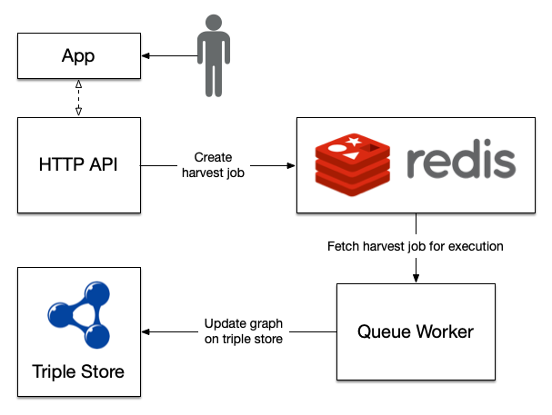

# BREG-DCAT Harvester

## Introduction

Harvester for RDF datasets based on the [BRegDCAT](https://joinup.ec.europa.eu/collection/access-base-registries/solution/abr-specification-registry-registries) specification.

This are the project is divided in two distinct modules:

- The `api` folder contains a Flask-based HTTP API to manage asynchronous harvest jobs.
- The `app` folder contains a React-based application to serve as the user entrypoint to the API.

Main features:

- Collect machine-readable files described in RDF/XML, RDF Turtle, N-triples and JSON-LD. This is known as a _harvest job_.
- Schedule _harvest jobs_ to be run in a periodic fashion.

Each _harvest job_ basically consists of three phases:

- Retrieve the data from the remote sources.
- Validate the shapes in the data sources using the [ISA2 Interoperability Test Bed SHACL Validator](https://github.com/ISAITB/validator-resources-bregdcat-ap).
- Merge the data and update the graph in the triple store.

The following diagram presents a high-level view of the architecture and typical usage flow. The user first sets the periodic harvest interval or enqueues a manual job using the Web application; these serialized jobs are kept in an in-memory Redis data store. A [Queue Worker](https://python-rq.org/docs/workers/) observes the Redis store, pulling and executing jobs as they become available (only one job may be executed in parallel). Finally, the results of each job execution are persisted in the Virtuoso triple store.



## Deployment

Two distinct Docker Compose files are provided for deployment. The first is a self-contained stack (`docker-compose.yml`) that requires only for the data sources to be externally defined (see below). The second (`docker-compose-lean.yml`) assumes that the Virtuoso triple store is available externally, and thus does not define a Virtuoso service in the stack, expecting the configuration to be set explicitly.

Data sources are configured using the `$HARVESTER_SOURCES` environment variable. This variable should contain a list of lists in a JSON-serialized string. Each list item must contain two sub-items:

- The URI of the data source.
- The format of the data source as [defined by rdflib](https://rdflib.readthedocs.io/en/stable/plugin_parsers.html). It should be one of `xml`, `turtle`, `nt` or `json-ld`.

For example:

```
export HARVESTER_SOURCES='[["https://gist.githubusercontent.com/agmangas/b07a69fd8a4d415c8e3d7a7dff7e41e5/raw/e3d574fdcdd14a11acce566c98486bca3a0f1fa4/breg-sample-01.xml", "xml"], ["https://gist.githubusercontent.com/agmangas/5f737b17ebf97c318e2ca3b4099c4c19/raw/5a1411286eb86a9689230ffcd3052a72fee05d74/breg-sample-02.ttl", "turtle"], ["https://gist.githubusercontent.com/agmangas/6ddc1e3405d9e890c74f2c1daf28c3fc/raw/623c2392276ecd6b86201744e1eecea324b0ef4c/breg-sample-03.json", "json-ld"]]'
```

The data sources variable is then explicitly injected by the Compose files into the _api_ container.

Once the data sources have been defined in the environment a new self-contained stack may be deployed with the following command:

```
$ docker-compose up -d --build

...

Creating breg-harvester_virtuoso_1 ... done
Creating breg-harvester_redis_1    ... done
Creating breg-harvester_api_1      ... done
Creating breg-harvester_worker_1   ... done
```

The Web application will then be available on port **9090**.

## API

### API Configuration

| Variable                           | Default                                   | Description                                         |
| ---------------------------------- | ----------------------------------------- | --------------------------------------------------- |
| `HARVESTER_LOG_LEVEL`              | `info`                                    | Log level of the API logger.                        |
| `HARVESTER_REDIS`                  | `redis://redis`                           | Redis URL for the jobs queue.                       |
| `HARVESTER_SPARQL_ENDPOINT`        | `http://virtuoso:8890/sparql`             | Virtuoso SPARQL query endpoint.                     |
| `HARVESTER_SPARQL_UPDATE_ENDPOINT` | `http://virtuoso:8890/sparql-auth`        | Virtuoso SPARQL update endpoint.                    |
| `HARVESTER_GRAPH_URI`              | `http://fundacionctic.org/breg-harvester` | Default graph URI.                                  |
| `HARVESTER_SPARQL_USER`            | `dba`                                     | User of the Virtuoso triple store.                  |
| `HARVESTER_SPARQL_PASS`            | `dba`                                     | Password for the user of the Virtuoso triple store. |
| `HARVESTER_VALIDATOR_DISABLED`     | _None_                                    | Flag to disable the SHACL validator API.            |
| `HARVESTER_RESULT_TTL`             | `2592000` _(30 days)_                     | Seconds that successful jobs will be kept in Redis. |

### API Usage

Create a new harvest job:

```
$ curl -X POST http://localhost:9090/api/harvest/
{
	"description": "breg_harvester.harvest.run_harvest(graph_uri='http://fundacionctic.org/breg-harvester', sources=[<SourceDataset> Type='DataTypes.XML' URI='https://gist.githubusercontent.c..., store_kwargs={'query_endpoint': 'http://virtuoso:8890/sparql', 'update_endpoint': 'http:..., validator=<breg_harvester.validator.BRegAPIValidator object at 0x7f6b68034b00>)",
	"ended_at": null,
	"enqueued_at": "2020-09-28T07:20:40.700335",
	"exc_info": null,
	"job_id": "5c47a2e3-19ad-49f8-baff-547d93e9b738",
	"result": null,
	"started_at": null,
	"status": "queued"
}
```

Fetch the current status of a previously created harvest job using the job ID provided in the _POST_ response:

```
$ curl -X GET http://localhost:9090/api/harvest/5c47a2e3-19ad-49f8-baff-547d93e9b738
{
	"description": "breg_harvester.harvest.run_harvest(graph_uri='http://fundacionctic.org/breg-harvester', sources=[<SourceDataset> Type='DataTypes.XML' URI='https://gist.githubusercontent.c..., store_kwargs={'query_endpoint': 'http://virtuoso:8890/sparql', 'update_endpoint': 'http:..., validator=<breg_harvester.validator.BRegAPIValidator object at 0x7f6b68034b00>)",
	"ended_at": "2020-09-28T07:20:43.988582",
	"enqueued_at": "2020-09-28T07:20:40.700335",
	"exc_info": null,
	"job_id": "5c47a2e3-19ad-49f8-baff-547d93e9b738",
	"result": {
		"num_triples": 33,
		"sources": [{
			"data_type": "xml",
			"format": "xml",
			"mime": "application/rdf+xml",
			"uri": "https://gist.githubusercontent.com/agmangas/b07a69fd8a4d415c8e3d7a7dff7e41e5/raw/e3d574fdcdd14a11acce566c98486bca3a0f1fa4/breg-sample-01.xml"
		}, {
			"data_type": "turtle",
			"format": "turtle",
			"mime": "text/turtle",
			"uri": "https://gist.githubusercontent.com/agmangas/5f737b17ebf97c318e2ca3b4099c4c19/raw/5a1411286eb86a9689230ffcd3052a72fee05d74/breg-sample-02.ttl"
		}, {
			"data_type": "json-ld",
			"format": "json-ld",
			"mime": "application/ld+json",
			"uri": "https://gist.githubusercontent.com/agmangas/6ddc1e3405d9e890c74f2c1daf28c3fc/raw/623c2392276ecd6b86201744e1eecea324b0ef4c/breg-sample-03.json"
		}]
	},
	"started_at": "2020-09-28T07:20:41.049328",
	"status": "finished"
}
```

Fetch the list of the most recent jobs grouped by job status:

```
$ curl -X GET http://localhost:9090/api/harvest/
{
	"failed": [],
	"finished": [{
		"ended_at": "2020-09-28T07:20:43.988582",
		"enqueued_at": "2020-09-28T07:20:40.700335",
		"job_id": "5c47a2e3-19ad-49f8-baff-547d93e9b738",
		"started_at": "2020-09-28T07:20:41.049328",
		"status": "finished"
	}],
	"scheduled": [],
	"started": []
}
```

Fetch the current configuration of the scheduler:

```
$ curl -X GET http://localhost:9090/api/scheduler/
{
	"id": "scheduled-harvester",
	"interval_seconds": 432000.0,
	"name": "scheduled-harvester",
	"next_date": "2020-10-03T07:12:38.329589+00:00"
}
```

Update the scheduler interval:

```
$ curl -X POST --header "Content-Type: application/json" --data '{"interval": 1800}' http://localhost:9090/api/scheduler/
{
	"id": "scheduled-harvester",
	"interval_seconds": 1800.0,
	"name": "scheduled-harvester",
	"next_date": "2020-09-28T08:15:30.650931+00:00"
}
```

## Adaptability

The harvester is reasonably agnostic to the actual RDF specification being used (in this case **BRegDCAT**). A new validator class could be easily implemented for any specification and injected into the environment. To this end, please see the `validator` module.
